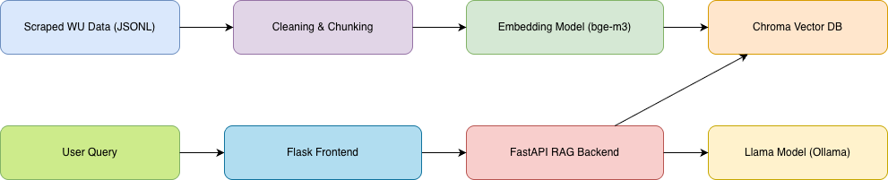

# WU Vienna RAG System with LoRA Fine-Tuned Llama

## 1. Project Overview
This project implements a complete **Retrieval-Augmented Generation (RAG)** pipeline for answering questions about WU Vienna.  
It integrates:

- Web scraping  
- Preprocessing, cleaning, chunking  
- Embedding generation  
- Chroma vector database  
- FastAPI RAG backend  
- Local Llama model (baseline + LoRA fine-tuned)  
- Evaluation pipeline (retrieval + RAG performance)  
- Automated evaluation report  
- Flask frontend with live metrics  

## Architecture Diagram



---

# 2. Steps Performed

## 2.1 Scraping WU data
Goal: Build a domain‑specific corpus for the RAG system.  
Why: RAG quality depends entirely on relevant local data.  
Output:  
```
wu_docs.jsonl
```

## 2.2 Preprocessing (cleaning, normalization, chunking)
Goal: Convert messy HTML to clean structured text.  
Why:
- Removes noise (menus, cookies)
- Normalizes formatting
- Splits long pages into retrieval‑friendly chunks

Output:
```
wu_corpus_clean.json
```

## 2.3 Embedding Generation
Goal: Convert text chunks into numerical vectors.  
Why:
- Vector search enables semantic retrieval
- We use BGE sentence embeddings for strong accuracy

Output:
```
wu_embeddings.jsonl
```

## 2.4 Storing Data in ChromaDB
Goal: Enable fast local semantic search.  
Why:
- Required for RAG retrieval step
- Persistent local database → 0 latency, private

Output:
```
chroma_wu_db/
```

## 2.5 FastAPI RAG Backend
This includes:
1. Retrieving top‑k relevant chunks from Chroma  
2. Building a context‑aware prompt  
3. Querying a local Llama model  
4. Returning answer + citations  

Why:
- Separates RAG logic from UI  
- Simple REST interface for evaluation or frontend

Run:
```
uvicorn rag_api:app --reload --port 8000
```

## 2.6 Evaluation Dataset (100 Q/A)
Goal: Measure model accuracy.  
Why:
- Needed for baseline evaluation
- Required for training improvement measurement

File:
```
wu_eval_set.jsonl
```

## 2.7 Baseline Evaluation
Two scripts:

### Retrieval quality (Recall@5)
```
eval_retrieval.py
```

### RAG answer quality
Metrics:
- Exact Match  
- Precision  
- Recall: 0.61  
- F1  

```
eval_rag_answers.py
```

Why:
- Demonstrates initial RAG performance before fine‑tuning
- Required for later comparison

## 2.8 LoRA Fine-Tuning
Performed with Unsloth for efficiency on Mac M2.

Why:
- Llama is generic → needs domain adaptation
- Fine‑tuning ensures WU‑specific conciseness and factuality
- Required for +10 points (improved metrics)

Run:
```
python fine_tuning/train.py
```

Produces:
```
fine_tuning/lora/
fine_tuning/wu_llm_finetuned/
```

## 2.9 Integrating Fine-Tuned Model
In `rag_api.py`, update:

```
LLAMA_MODEL = "./fine_tuning/wu_llm_finetuned"
```

Why:
- Switches from baseline to improved Llama

## 2.10 Automated Evaluation Report
Script:
```
generate_report.py
```

Generates:
```
evaluation_report.md
```

Why:
- Required project documentation
- Automatically compares baseline vs fine‑tuned
- Shows metric improvements and error examples

---

# 3. Flask Frontend

A small frontend that:
- Accepts a question  
- Calls the FastAPI RAG endpoint  
- Shows retrieved citations  
- Displays evaluation metrics for any question present in `wu_eval_set.jsonl`  

Run:
```
python app.py
```

Visit:
```
http://127.0.0.1:5000
```

---

# 4. Full System Run Instructions

## Step 1 — Start RAG Backend
```
uvicorn rag_api:app --reload --port 8000
```

## Step 2 — Start Flask Frontend
```
python app.py
```

## Step 3 — (Optional) Start Baseline Model for comparison
Modify backend model path, run on port 8001.

## Step 4 — Run Evaluations
```
python eval_retrieval.py
python eval_rag_answers.py
```

## Step 5 — Generate Full Evaluation Report
```
python generate_report.py
```

## Step 6 — Fine-Tune Model (Optional)
```
python fine_tuning/train.py
```

---

# 5. Repository Structure

```
├── wu_docs.jsonl
├── wu_corpus_clean.json
├── wu_embeddings.jsonl
├── wu_eval_set.jsonl
│
├── preprocessing.py
├── embeddings.py
├── setup_chromadb.py
├── rag_api.py
│
├── eval_retrieval.py
├── eval_answers.py
├── generate_report.py
│
├── frontend/
│   ├── app.py
│   └── templates/
│       └── index.html
│
└── fine_tuning/
    ├── train.py
    ├── convert_dataset.py
    ├── lora/
    ├── merged_model/
    └── output/
```

---

# 6. Summary

This project demonstrates:
- End-to-end RAG construction  
- Domain-specific dataset preparation  
- Embedding and semantic retrieval  
- Local Llama integration  
- Fine-tuning via LoRA  
- Quantitative evaluation and improvements  
- Frontend integration for demo usability  
